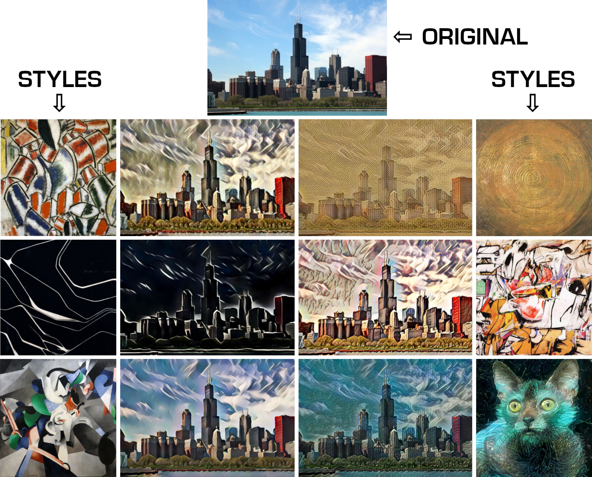
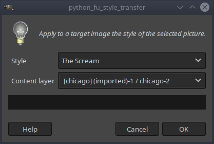
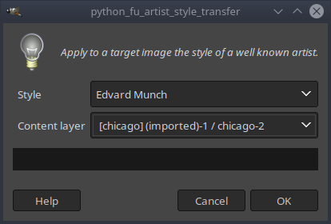
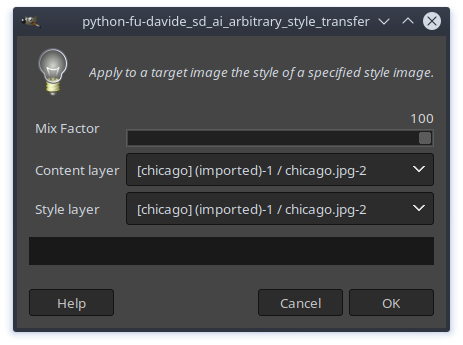
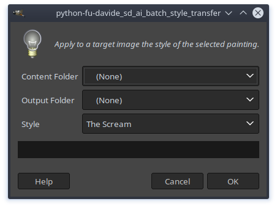
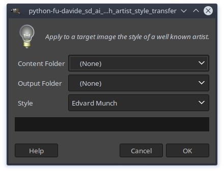
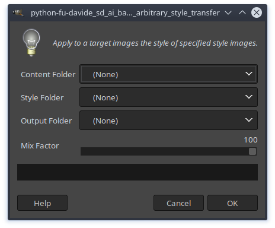

# GIMP Style Transfer

**This is a prototype plugin (or a proof of concept, if you wish) intended to demonstrate the feasibility to expand GIMP abilities with state of the art machine learning algorithms.**

This plugin adds the ability to perform Neural Style Transfer, which reconstruct a *content image* (the selected GIMP layer) with the style of a *style image* (selected with the plugin).

You may have used apps that do this kind of processing, like [Prisma](https://prisma-ai.com/) (or something similar).

You can apply style transfer in two ways:
1. As a filter on a selected layer.
2. In batch mode to a folder containing your content pictures.

Please, see section **Usage** for more instructions.

## Implementations

At the moment, the following approaches are implemented in the plugin:

* **Style Transfer**. Based on [Fast Style Transfer](https://github.com/lengstrom/fast-style-transfer): transfer the style of well know paintings to your images.
I have not yet received authorization to release its code. Follow *Install instruction* below to get this implementation working.  
Once installed, you will find it in the menu `Filters/Style Transfer/Style Transfer...`.

| Pros | Cons |
|-------------------------------------|----------------------------------------------------|
| Fast | Only 6 styles available |
| Nice results | Eventually, need to train new models |
| Style's model file size not too big | Training requires expensive GPUs and a lot of time |
|  | By adding new styles, we need more storage space for them  |

* **Artist Style Transfer**. Based on [Adaptive Style Transfer implementation](https://github.com/CompVis/adaptive-style-transfer): apply the style of a given artist to your image.  
Once installed, you will find it in the menu `Filters/Style Transfer/Artist Style Transfer...`.

| Pros | Cons |
|------|------------------------------------------------------------------------------------------|
| Fast | Only 13 artists available |
|  | Eventually, need to train new models |
|  | Training requires expensive GPUs and a lot of time |
|  | Big model file size (requires a lot of storage space) |

* **Arbitrary Style Transfer**. Based on [Adaptive Style Transfer](https://github.com/tensorlayer/adaptive-style-transfer) developed by the [Tensorlayer team](https://github.com/tensorlayer/tensorlayer): transfer the style of a given image to your content images.  
Once installed, you will find it in the menu `Filters/Style Transfer/Arbitrary Style Transfer...`.

| Pros | Cons |
|------------------------------------------------------------------------|-----------------------------------|
| Fast | Little bit slower than the others |
| No need to train new models for a new style |  |
| Overall small file size because it only stores the 2 pretrained models |  |

Please, take a look at the repositories linked above to get a visual idea of what this plugin allows us to do.

## Requirements

I developed this plugin on Ubuntu 18.04, GIMP 2.10.8, Python 2.7. AFAIK *tensorflow* requires Python 3.5+ on Windows to work, therefore I strongly believe this plugin will not work on Windows (feel free to try and prove me wrong).

* Install [Tensorflow](https://www.tensorflow.org/install) on the Python environment used by GIMP (usually version 2.7) with `pip install tensorflow`.  
I tested this plugin with `tensorflow` CPU only. Feel free to test it also with `tensorflow-gpu` by installing the module `pip install tensorflow-gpu` (you need a CUDA-enabled GPU card).  
Note: if you are using an *old* CPU that does not support AVX instruction set, you will have to [build the latest version from source](https://www.tensorflow.org/install/source) (it may take a while on older CPU).

* Install the following Python packages: `PIL, numpy, scipy, tensorlayer`

* You also need to install `python-tk` with the command: `sudo apt-get install python-tk`

## Install

1. Open the terminal, move to the GIMP plug-ins folder (usually `~/.config/GIMP/2.10/plug-ins`).

2. `git clone https://github.com/Davide-sd/GIMP-style-transfer.git`

3. `cd GIMP-style-transfer`

4. Change permission to allow execution: `chmod +x GIMP-style-transfer.py`

5. Don't forget to apply the following steps: *Setting up Style Transfer* and/or *Setting up Artist Style Transfer* and/or *Setting up Arbitrary Style Transfer*.

### Setting up [Style Transfer](https://github.com/lengstrom/fast-style-transfer)

Since I have not yet received any reply to my inquire regarding the possibility of releasing that code, you have to follow these steps to get it working.

1. Download the repository [Fast Style Transfer](https://github.com/lengstrom/fast-style-transfer) and extract it wherewever you want.
2. Copy the file `fast-style-transfer/src/transform.py` into the plugin folder `GIMP-style-transfer/implementation_1/src`.
3. Downloads the models for this implementation [located at this link](https://drive.google.com/drive/folders/0B9jhaT37ydSyRk9UX0wwX3BpMzQ) (this will results in 115MB of uncompressed data). Extract the `.ckpt` files into the folder `GIMP-style-transfer/implementation_1/models`.  
You can download only the models you are interested in (the plugin will adapt accordingly).

At this point you should be able to use the plugin located in the menu `Filters/Style Transfer/Style Transfer...`.

### Setting up [Artist Style Transfer](https://github.com/CompVis/adaptive-style-transfer)

1. Downloads the models for the this implementation [located at this link](https://hcicloud.iwr.uni-heidelberg.de/index.php/s/XXVKT5grAquXNqi).  **Warning: this will results in 9.1GB of uncompressed data!!!!**  
Extract the archives into the folder `GIMP-style-transfer/implementation_2/models`.  
You can download only the models you are interested in (the plugin will adapt accordingly).

At this point you should be able to use the plugin located in the menu `Filters/Style Transfer/Artist Style Transfer...`.

### Setting up [Arbitrary Style Transfer](https://github.com/tensorlayer/adaptive-style-transfer)

1. Download pretrained models. This will result in 40.2MB of data (click the following links and then the Download button):  
    * [pretrained_vgg19_decoder_model.npz](https://github.com/tensorlayer/pretrained-models/blob/master/models/style_transfer_models_and_examples/pretrained_vgg19_decoder_model.npz)
    * [pretrained_vgg19_encoder_model.npz](https://github.com/tensorlayer/pretrained-models/blob/master/models/style_transfer_models_and_examples/pretrained_vgg19_encoder_model.npz)
2. Move the downloaded files into `GIMP-style-transfer/implementation_3/models`

At this point you should be able to use the plugin located in the menu `Filters/Style Transfer/Arbitrary Style Transfer...`.

## Usage

For the following plugins, you can either select a single layer or a group layer. In the latter case, the selected style will be transferred to all the sub-layers.

### Style Transfer and Artist Style Transfer Filter

1. Open an image (start playing with small images, read the **Memory Usage** section carefully!).
2. Click on `Filters/Style Transfer/Artist Style Transfer...` or `Filters/Style Transfer/Style Transfer...`
3. Select the desired style from the combobox.
4. Select the desired layer.
5. Click `Ok` and wait for the process to complete.

|  |  |
|-------------------------------------------------------------|---------------------------------------------------------------------------|

### Arbitrary Style Transfer Filter

1. Open an image (start playing with small images, read the **Memory Usage** section carefully!). The image must contains two or more layers. The layers can have different dimensions from each other.
2. Click on `Filters/Style Transfer/Arbitrary Style Transfer...`
3. Select the style layer.
4. Select the content layer.
5. Click `Ok` and wait for the process to complete.

### Batch Mode

You can apply style transfer to a folder containing your content pictures.

1. Click on `File/Batch Style Transfer/` and select the desired implementation to run.
2. Select the folder containing your images.
3. Select the style to apply.
4. Click `OK` and wait for the transfer to complete.

|  |  |  |
|-------------------------------------------------------------------------|---------------------------------------------------------------------------------------|---------------------------------------------------------------------------------------------|

## Memory Usage

Style Transfer requires a *huge* amount of RAM. I would advise against testing this plugin on systems with less than 4GB of RAM.

To give you an example, with a `1200px X 800px` image I noticed a boost in RAM usage of 2.5GB (when executing the algorithms on CPU only).

The memory usage increases rapidly with the input image size! Start testing with smaller images, then gradually increase the image size.

**It would be nice if someone (with a decent amount of RAM) could create a plot relating image size (pixels) vs memory used (see section *TODO* point 1).**

## TODO

1. Compute an estimate of the memory necessary to perform the computation on the input image. Do not perform the computation if this value exceeds the total amount of free memory (and inform the user).

2. Look at the possibility to extract only the meaningfull weights from the [Artist Style Transfer implementation](https://github.com/CompVis/adaptive-style-transfer) models, in order to significantly reduce their file sizes.

3. Look for strategies to get this plugin working on Windows.

## FAQ

### Who is this plugin for?

This plugin is meant for GIMP developers. The objectives of this plugin are:

1. To create curiosity between existing and new GIMP developers towards machine learning algorithms.
2. Proof of concept that GIMP can be further and successfully extended by using machine learning algorithms.
3. Identify the best strategies to get GIMP and Tensorflow (or any other machine learning frameworks) to work togheter (even on Windows).
4. Experiment with different implementations, understanding their pros and cons, understand why a given model produces a certain result.

### Who is this plugin NOT for?

This plugin is NOT meant for the generic GIMP user. Don't even try to go through the hassle of setting up your system for this plugin. You probably would end up disappointed with the results...

### I would like more models to play with. What should I do?

Look at the respective implementations pages: you will find the instructions to train new models. This procedure is only recomended if you use a decent CUDA-enabled GPU card. If you are going to train new models, feel free to share them on this repository.
